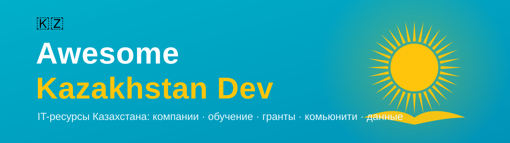

  

  
  
  
  

# Awesome Kazakhstan Dev

> 🇰🇿 Кураторский список ресурсов для IT-специалистов Казахстана: компании, гранты, обучение, комьюнити, датасеты и инструменты.

Куда идти в IT в Казахстане, где учиться, к кому податься на работу, где получить грант и с кем общаться — всё в одном месте. Список поддерживается сообществом. Если чего-то не хватает — [добавьте через PR](CONTRIBUTING.md).

*A curated list of Kazakhstan IT resources: companies, grants, education, communities, datasets and tools. Contributions welcome.*

---

## Содержание

- [🏢 IT-компании](#-it-компании)
- [🎓 Обучение](#-обучение)
- [💰 Гранты и программы](#-гранты-и-программы)
- [👥 Комьюнити и чаты](#-комьюнити-и-чаты)
- [📰 Медиа и блоги](#-медиа-и-блоги)
- [🎤 Конференции и события](#-конференции-и-события)
- [🔌 API и открытые данные](#-api-и-открытые-данные)
- [📊 Датасеты](#-датасеты)
- [🛠️ Инструменты и библиотеки](#️-инструменты-и-библиотеки)
- [💼 Поиск работы](#-поиск-работы)
- [🤝 Как внести вклад](#-как-внести-вклад)

---

## 🏢 IT-компании

Крупнейшие технологические работодатели и продуктовые компании страны.

- [Kaspi.kz](https://kaspi.kz) — крупнейший финтех/e-commerce супер-апп Казахстана.
- [Kolesa Group](https://kolesa.team) — классифайды (Kolesa.kz, Krisha.kz, Auto.kz), одна из сильнейших инженерных культур в стране.
- [inDrive](https://indrive.com) — глобальный райд-хейлинг сервис, вырос из Якутии/Казахстана в мировой продукт.
- [Chocofamily](https://chocofamily.kz) — экосистема сервисов (Chocolife, Rahmet, Chocotravel).
- [Freedom Holding](https://ffin.kz) — финтех и брокеридж, активная разработка.
- [Halyk Bank](https://halykbank.kz) — крупнейший банк, сильная внутренняя разработка (Homebank).
- [DAR / Digital Business](https://dar.tech) — экосистема цифровых продуктов.
- [Beeline Kazakhstan](https://beeline.kz) — телеком и цифровые сервисы.
- [Kcell](https://www.kcell.kz) — телеком-оператор.

> 💡 Более полный список резидентов — на портале [Astana Hub](https://astanahub.com).

## 🎓 Обучение

Где получить IT-образование — от школ до университетов.

### Буткемпы и школы

- [nFactorial Incubator](https://www.nfactorial.school) — интенсивный буткемп, один из главных инкубаторов IT-талантов в КЗ.
- [Alem School](https://alem.school) — бесплатная школа программирования по методологии peer-to-peer (по модели 42/School 21).
- [Astana IT University Bootcamps](https://astanait.edu.kz) — краткосрочные программы.

### Университеты с сильным IT

- [Nazarbayev University](https://nu.edu.kz) — Computer Science на английском, исследовательский фокус.
- [Astana IT University (AITU)](https://astanait.edu.kz) — профильный IT-университет.
- [Kazakh-British Technical University (KBTU)](https://kbtu.edu.kz) — сильная школа IT и инженерии.
- [SDU University](https://sdu.edu.kz) — Computer Science, активное комьюнити.
- [International IT University (IITU)](https://iitu.edu.kz) — Алматы, профильный IT.

## 💰 Гранты и программы

- [TechOrda](https://techorda.astanahub.com) — государственная грантовая программа на обучение IT-профессиям.
- [Astana Hub](https://astanahub.com) — международный технопарк: льготы, акселерация, гранты для стартапов.
- [Startup Kazakhstan](https://astanahub.com/en/startup) — акселерационная программа для ранних стартапов.
- [QazTech Ventures](https://qaztech.gov.kz) — институт развития предпринимательства и технологий.
- [Digital Kazakhstan](https://digitalkz.kz) — государственная программа цифровизации.

## 👥 Комьюнити и чаты

- [Astana Hub Community](https://astanahub.com) — крупнейшее IT-сообщество страны.
- [GDG (Google Developer Groups) Almaty / Astana](https://gdg.community.dev) — митапы Google-разработчиков.

### Telegram — общие

- [Programmers Kazakhstan (devkz)](https://t.me/devkz) — главный чат разработчиков КЗ.
- [IT.kz (allkzit)](https://t.me/allkzit) — общий IT-чат страны.
- [The Tech KZ Chat](https://t.me/thetechkzchat) — сообщество вокруг медиа The Tech.

### Telegram — по стекам

- [Frontend Kazakhstan](https://t.me/frontendkz) — фронтенд-разработчики.
- [Backend Developers Kazakhstan](https://t.me/backenderskz) — бэкенд.
- [Python Kazakhstan](https://t.me/python_kz) — Python.
- [Golang Kazakhstan](https://t.me/go_kz) — Go.
- [Astana JUG](https://t.me/astanajug) — Java.
- [PHP Developers KZ](https://t.me/phpdevconf) — PHP.
- [Rust Kazakhstan](https://t.me/rustlang_kz) — Rust.
- [.NET Kazakhstan](https://t.me/dotnetgroup) — .NET.
- [iOS Developers KZ](https://t.me/iOSDevelopers_KZ) — iOS.
- [Flutter Dart KZ](https://t.me/dart_kz) — Flutter/Dart.
- [KazDevOps](https://t.me/devopskaz) — DevOps.
- [AQA Kazakhstan](https://t.me/AQA_kz) — QA-автоматизация.

> 📚 Более полный и регулярно обновляемый список — [KZ-IT-telegram-list](https://github.com/c0rp-aubakirov/KZ-IT-telegram-list).
> ⚠️ Ссылки на Telegram-чаты со временем протухают — нашли мёртвую? [Сообщите через PR/Issue](CONTRIBUTING.md).

## 📰 Медиа и блоги

- [Bluescreen.kz](https://bluescreen.kz) — IT-новости Казахстана.
- [Profit.kz](https://profit.kz) — бизнес и технологии.
- [Digital Business](https://digitalbusiness.kz) — цифровая экономика и стартапы.
- [The Tech](https://the-tech.kz) — технологические истории и продукты КЗ.

## 🎤 Конференции и события

- [Digital Almaty](https://digitalalmaty.kz) — крупнейший цифровой форум региона.
- [Astana Hub Battle / Decentrathon](https://astanahub.com) — хакатоны и питч-баттлы.
- [nFactorial Demo Day](https://www.nfactorial.school) — демо-день выпускников инкубатора.

## 🔌 API и открытые данные

- [eGov Open Data (data.egov.kz)](https://data.egov.kz) — портал открытых данных правительства РК.
- [Национальный банк РК — курсы валют](https://nationalbank.kz) — официальные курсы (XML/API).
- [Kazpost API](https://post.kz) — отслеживание отправлений (по запросу).
- [2GIS API](https://dev.2gis.ru) — карты, геокодинг, справочник организаций (покрытие КЗ).

## 📊 Датасеты

### Государственные / открытые данные

- [data.egov.kz](https://data.egov.kz) — статистика, реестры, справочники в открытом доступе.
- [Бюро национальной статистики (stat.gov.kz)](https://stat.gov.kz) — демография, экономика, рынки.

### Казахский язык (речь и текст)

- [ISSAI Datasets](https://issai.nu.edu.kz/issai-datasets/) — портал датасетов Института умных систем и ИИ (Nazarbayev University).
- [IS2AI/Kazakh_TTS](https://github.com/IS2AI/Kazakh_TTS) — корпус синтеза речи (KazakhTTS2), 271 час, 5 дикторов.
- [IS2AI/ISSAI_SAIDA_Kazakh_ASR](https://github.com/IS2AI/ISSAI_SAIDA_Kazakh_ASR) — крупнейший открытый корпус распознавания речи (KSC2), ~1.2k часов.
- [IS2AI/KazNERD](https://github.com/IS2AI/KazNERD) — датасет распознавания именованных сущностей (25 классов, 112k предложений).
- [IS2AI (GitHub)](https://github.com/IS2AI) — другие открытые датасеты и модели по казахскому языку.

## 🛠️ Инструменты и библиотеки

Open-source инструменты, полезные именно в казахстанском контексте.

### Валидация ИИН/БИН

- [ZhymabekRoman/kz-iin-validator](https://github.com/ZhymabekRoman/kz-iin-validator) — проверка и извлечение данных из ИИН, Python 3 ([PyPI](https://pypi.org/project/kz-iin-validator/)).
- [Mi7teR/inn-validate](https://github.com/Mi7teR/inn-validate) — валидация ИИН и БИН физ- и юрлиц, JavaScript/npm.
- [DiyazY/IIN-BIN](https://github.com/DiyazY/IIN-BIN) — валидация и парсинг ИИН/БИН, JavaScript.

### Транслитерация (кириллица ↔ латиница)

- [talgautb/qazlatyn-db](https://github.com/talgautb/qazlatyn-db) — данные казахского латинского алфавита (qazaq latyn), npm.
- [pheeria/qazaqca](https://github.com/pheeria/qazaqca) — транслитератор казахского с кириллицы на латиницу.

### NLP и обработка языка

- [nlacslab/kaznlp](https://github.com/nlacslab/kaznlp) — NLP-пайплайн для казахского: токенизация, морфология, NER, нормализация (Python).
- [nlacslab/kazdet](https://github.com/nlacslab/kazdet) — Kazakh Dependency Treebank (синтаксический корпус).

> 🚧 Раздел растёт. Сделали или знаете такой инструмент? [Добавьте его!](CONTRIBUTING.md)

## 💼 Поиск работы

- [hh.kz](https://hh.kz) — крупнейший job-борд.
- [LinkedIn](https://linkedin.com) — актуально для международных и продуктовых вакансий.
- [Astana Hub Jobs](https://astanahub.com) — вакансии резидентов технопарка.

**Telegram-каналы с вакансиями:**

- [Work IT KZ](https://t.me/workitkz) — IT-вакансии Казахстана.
- [DevKZ Jobs](https://t.me/devkz_jobs) — вакансии от сообщества devkz.
- [IT Jobs (DSML.KZ)](https://t.me/it_jobs_kz) — вакансии в Data Science / ML.
- [Golang vacancies in KZ](https://t.me/go_kz_vacancy) — вакансии для Go-разработчиков.

---

## 🤝 Как внести вклад

Список живёт за счёт сообщества! Нашли неточность, протухшую ссылку или знаете отличный ресурс — открывайте [Pull Request](CONTRIBUTING.md) или [Issue](../../issues).

Правила оформления — в [CONTRIBUTING.md](CONTRIBUTING.md).

## Лицензия

Этот список распространяется под лицензией [CC0 1.0](LICENSE) — используйте свободно.
